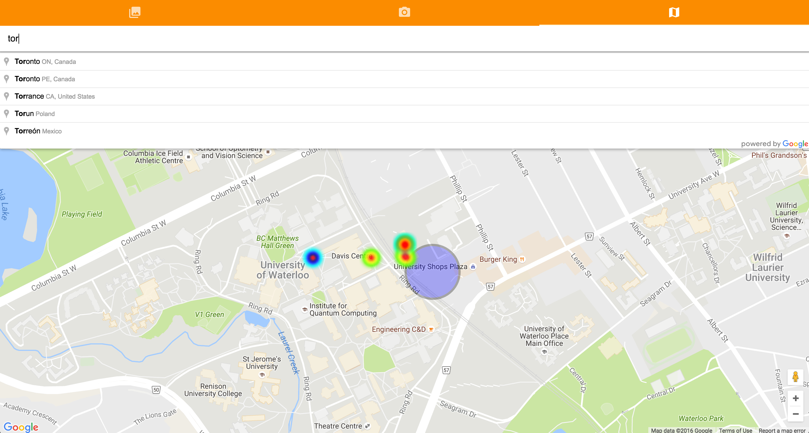
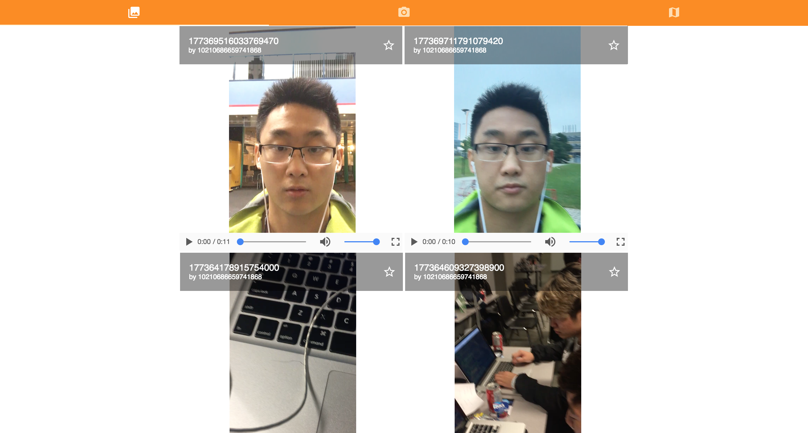

# Vio

Location-based video diaries with sentimental analysis. These are crowdsourced to create a geospatial mood heatmap.
Made at Hack the North 2016.





## Set-up

```
$ npm i
$ srlt restore
$ make serve
$ Hit up localhost:5001
```

## Links
[http://devpost.com/software/vio](http://devpost.com/software/vio)
